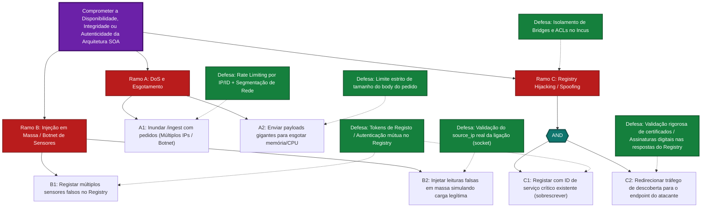

```mermaid

graph TD
    %% Raiz Global
    Root["Comprometer a Disponibilidade, Integridade ou Autenticidade da Arquitetura SOA"] --> RamoA["Ramo A: DoS e Esgotamento"]
    Root --> RamoB["Ramo B: Injeção em Massa / Botnet de Sensores"]
    Root --> RamoC["Ramo C: Registry Hijacking / Spoofing"]

    %% Ramo A (DoS)
    RamoA --> A1["A1: Inundar /ingest com pedidos (Múltiplos IPs / Botnet)"]
    RamoA --> A2["A2: Enviar payloads gigantes para esgotar memória/CPU"]

    %% Ramo B (Sensores Falsos / Botnet)
    RamoB --> B1["B1: Registar múltiplos sensores falsos no Registry"]
    RamoB --> B2["B2: Injetar leituras falsas em massa simulando carga legítima"]

    %% Ramo C (Registry Spoofing - com lógica AND)
    RamoC --> C_And{{"AND"}}
    C_And --> C1["C1: Registar com ID de serviço crítico existente (sobrescrever)"]
    C_And --> C2["C2: Redirecionar tráfego de descoberta para o endpoint do atacante"]

    %% Defesas / Contramedidas (ligadas a tracejado)
    Def1["Defesa: Rate Limiting por IP/ID + Segmentação de Rede"] -.-> A1
    Def2["Defesa: Limite estrito de tamanho do body do pedido"] -.-> A2
    Def3["Defesa: Tokens de Registo / Autenticação mútua no Registry"] -.-> B1
    Def3 -.-> C1
    Def4["Defesa: Validação do source_ip real da ligação (socket)"] -.-> B2
    Def5["Defesa: Validação rigorosa de certificados / Assinaturas digitais nas respostas do Registry"] -.-> C2
    Def6["Defesa: Isolamento de Bridges e ACLs no Incus"] -.-> RamoC

    %% Estilos visuais
    style Root fill:#6B21A8,color:#FFFFFF,stroke:#3B0764,stroke-width:3px
    style C_And fill:#0F766E,color:#FFFFFF,stroke:#134E4A,stroke-width:3px
    style RamoA fill:#B91C1C,color:#FFFFFF,stroke:#7F1D1D,stroke-width:2px
    style RamoB fill:#B91C1C,color:#FFFFFF,stroke:#7F1D1D,stroke-width:2px
    style RamoC fill:#B91C1C,color:#FFFFFF,stroke:#7F1D1D,stroke-width:2px
    style Def1 fill:#15803D,color:#FFFFFF,stroke:#14532D,stroke-width:2px
    style Def2 fill:#15803D,color:#FFFFFF,stroke:#14532D,stroke-width:2px
    style Def3 fill:#15803D,color:#FFFFFF,stroke:#14532D,stroke-width:2px
    style Def4 fill:#15803D,color:#FFFFFF,stroke:#14532D,stroke-width:2px
    style Def5 fill:#15803D,color:#FFFFFF,stroke:#14532D,stroke-width:2px
    style Def6 fill:#15803D,color:#FFFFFF,stroke:#14532D,stroke-width:2px

    %% Estilo adicional para os nós intermédios
    classDef attack fill:#991B1B,color:#FFFFFF,stroke:#450A0A,stroke-width:1.5px
    classDef defense fill:#166534,color:#FFFFFF,stroke:#052E16,stroke-width:1.5px
    classDef rootStyle fill:#6B21A8,color:#FFFFFF,stroke:#3B0764,stroke-width:3px

```
