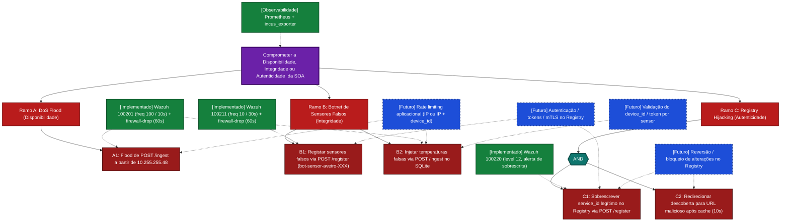

```mermaid

graph TD
    Root["Comprometer a Disponibilidade, Integridade ou Autenticidade  da SOA"] --> RamoA["Ramo A: DoS Flood (Disponibilidade)"]
    Root --> RamoB["Ramo B: Botnet de Sensores Falsos (Integridade)"]
    Root --> RamoC["Ramo C: Registry Hijacking (Autenticidade)"]
    RamoA --> A1["A1: Flood de POST /ingest a partir de 10.255.255.48"]
    RamoB --> B1["B1: Registar sensores falsos via POST /register (bot-sensor-aveiro-XXX)"]
    RamoB --> B2["B2: Injetar temperaturas falsas via POST /ingest no SQLite"]
    RamoC --> C_And{{"AND"}}
    C_And --> C1["C1: Sobrescrever service_id legítimo no Registry via POST /register"]
    C_And --> C2["C2: Redirecionar descoberta para URL malicioso após cache (10s)"]
    %% Controlos implementados
    DefImpl1["[Implementado] Wazuh 100201 (freq 100 / 10s) + firewall-drop (60s)"] -.-> A1
    DefImpl1 -.-> B2
    DefImpl2["[Implementado] Wazuh 100211 (freq 10 / 30s) + firewall-drop (60s)"] -.-> B1
    DefImpl3["[Implementado] Wazuh 100220 (level 12, alerta de sobrescrita)"] -.-> C1
    DefImpl4["[Observabilidade] Prometheus + incus_exporter"] -.-> Root
    %% Contramedidas / Trabalho futuro
    DefFut1["[Futuro] Rate limiting aplicacional (IP ou IP + device_id)"] -.-> A1
    DefFut1 -.-> B2
    DefFut2["[Futuro] Autenticação / tokens / mTLS no Registry"] -.-> B1
    DefFut2 -.-> C1
    DefFut3["[Futuro] Reversão / bloqueio de alterações no Registry"] -.-> C1
    DefFut3 -.-> C2
    DefFut4["[Futuro] Validação do device_id / token por sensor"] -.-> B2
    style Root fill:#6B21A8,color:#FFFFFF,stroke:#3B0764,stroke-width:3px
    style C_And fill:#0F766E,color:#FFFFFF,stroke:#134E4A,stroke-width:3px
    style RamoA fill:#B91C1C,color:#FFFFFF,stroke:#7F1D1D,stroke-width:2px
    style RamoB fill:#B91C1C,color:#FFFFFF,stroke:#7F1D1D,stroke-width:2px
    style RamoC fill:#B91C1C,color:#FFFFFF,stroke:#7F1D1D,stroke-width:2px
    style A1 fill:#991B1B,color:#FFFFFF,stroke:#450A0A,stroke-width:1.5px
    style B1 fill:#991B1B,color:#FFFFFF,stroke:#450A0A,stroke-width:1.5px
    style B2 fill:#991B1B,color:#FFFFFF,stroke:#450A0A,stroke-width:1.5px
    style C1 fill:#991B1B,color:#FFFFFF,stroke:#450A0A,stroke-width:1.5px
    style C2 fill:#991B1B,color:#FFFFFF,stroke:#450A0A,stroke-width:1.5px
    style DefImpl1 fill:#15803D,color:#FFFFFF,stroke:#14532D,stroke-width:2px
    style DefImpl2 fill:#15803D,color:#FFFFFF,stroke:#14532D,stroke-width:2px
    style DefImpl3 fill:#15803D,color:#FFFFFF,stroke:#14532D,stroke-width:2px
    style DefImpl4 fill:#15803D,color:#FFFFFF,stroke:#14532D,stroke-width:2px
    style DefFut1 fill:#1D4ED8,color:#FFFFFF,stroke:#1E3A8A,stroke-width:2px,stroke-dasharray: 5 5
    style DefFut2 fill:#1D4ED8,color:#FFFFFF,stroke:#1E3A8A,stroke-width:2px,stroke-dasharray: 5 5
    style DefFut3 fill:#1D4ED8,color:#FFFFFF,stroke:#1E3A8A,stroke-width:2px,stroke-dasharray: 5 5
    style DefFut4 fill:#1D4ED8,color:#FFFFFF,stroke:#1E3A8A,stroke-width:2px,stroke-dasharray: 5 5

```
